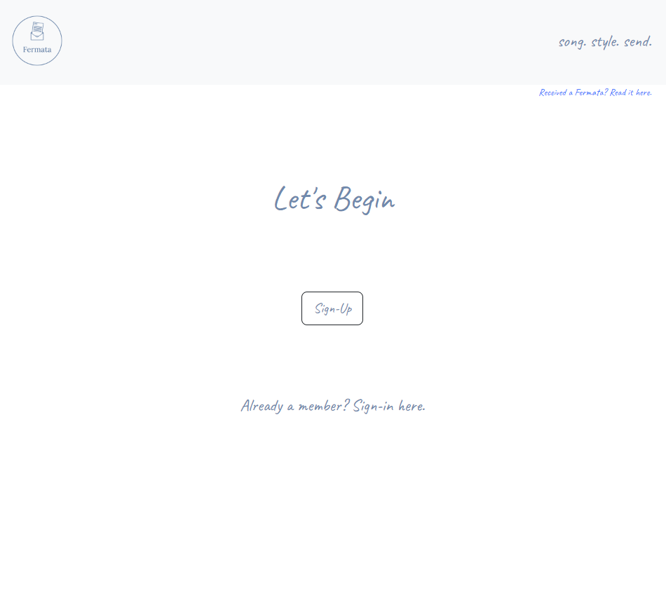
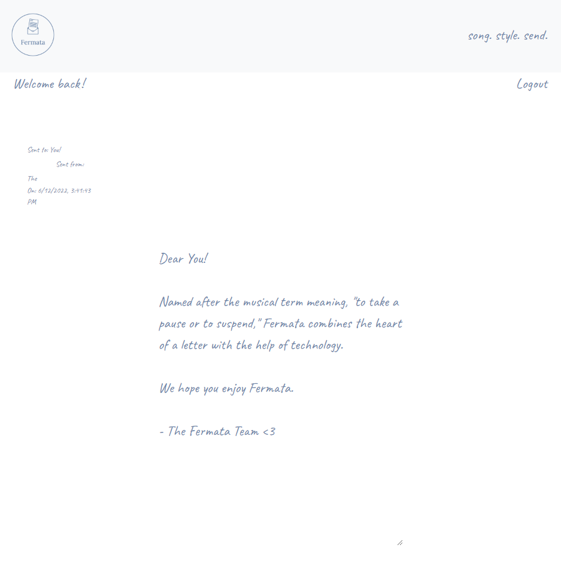

  # Fermata - The Modern Letter (song. style. send.)
   
    
  The act of writing a letter exemplifies care and consideration for who you're writing to and what it is that you're saying. Named after the musical term meaning, "to take a pause or to suspend," Fermata combines the heart of a letter with the help of technology to create a modern, digital letter. With options to choose a custom font and song to create an ambiance for your recipient, Fermata adds an extra personal touch to the messages you send.
  
  ## Table of Contents
  
  * [Installation](#installation)
  * [Built With](#built)
  * [Usage Information](#usage)
  * [Authors & Acknowledgements](#credits)
  * [License](#license)  
  * [Contact](#questions)  
  
  ## Installation
  The live application can be accessed using its deployed Heroku link. For developers, after cloning the repository, enter "npm i" in the terminal to install all required dependencies. Then, set up the database in MySQL using the following commands "mysql -h localhost -u root -p", source db/schema.sql", "quit", "npm run seed". Developers can pre-populate the seed files before running npm and test table joins using the database-test.js.

  ## Built With
  * HTML
  * CSS
  * JavaScript
  * YouTube 👀
  * Bootstrap
  * Materialize CSS
  * MySQL
  * Node.js
  * Express.js
  * Handlebars.js
  * Bcrypt
  * Express-session
  * Connect-session-sequelize
  * Express-handlebars
  * Dotenv
  * Mysql2
  * Sequelize
  * Uniqid
  * Insomnia
  * Heroku
  * Nodemon
  
  ## Usage Information
  Live application: [https://experience-fermata.herokuapp.com/home](https://experience-fermata.herokuapp.com/home)  
    
  The initial design for this application included the Spotify library, but the development team was unable to integrate this feature before the deadline. This application is currently powered by YouTube, but is not endorsed by YouTube. This application is for proof of concept only and at the time of initial deployment is only meant for project submission to University of Toronto's School of Continuing Studies Coding BootCamp. 
    
    
    
  ## Authors & Acknowledgements    
  Made with ❤️ by the Fermata Team. 
  Submitted 2022Jun12

  ### Author-Specific Acknowledgements
  #### Veronica
  Special thanks to the following articles: 
  Soufiane's regex [here](https://stackoverflow.com/questions/3717115/regular-expression-for-youtube-links) for YouTube links 
  Amitabh-K's regex [here](https://gist.github.com/Amitabh-K/ae073eea3d5207efaddffde19b1618e8) for emails 
  Ye Lin Aung's answer to date formatting [here](https://stackoverflow.com/questions/14638018/current-time-formatting-with-javascript) 
  Cerbrus's answer [here](https://stackoverflow.com/questions/14052473/go-to-local-url-with-javascript) which was helpful in early development 
  BadPiggie's answer on the different types of data storage [here](https://stackoverflow.com/questions/60050724/express-js-req-session-vs-cookie-vs-local-storage-vs-session-storage) 
  Parthik's answer [here](https://stackoverflow.com/questions/15839169/how-to-get-value-of-selected-radio-button) for radio button values 
  David's answer [here](https://stackoverflow.com/questions/69196421/seed-mysql-database-on-heroku) on seeding Heroku databases 
  And finally, the hack that saved us all, Kaeruct's article on YouTube autoplay embeds [here](https://kaeruct.github.io/posts/how-to-use-the-youtube-js-api-to-play-music-in-the-background.html)

  And the following resources for our mailto functionality: 
  [This](https://www.delftstack.com/howto/javascript/mailto-javascript/#:~:text=Use%20the%20code%20below%20and,to%20any%20element%20using%20JavaScript.&text=Copy%20var%20email%20%3D%20document.,mail.com%22%3B%20email.) DelftStack article 
  In conjunction with [this](https://www.angelfire.com/dc/html-webmaster/mailto.htm) article 
  Rohit's article [here](https://tutorial.eyehunts.com/html/mailto-body-line-break-multiple-lines-example-code/#:~:text=Use%20Encoding%20%0D%0A%20in,content%2Ftext%20in%20the%20body.) 
  Cabrakan's answer [here](https://stackoverflow.com/questions/50368162/unicode-value-in-template-literal-for-emoji) for unicode emojis 
  [This](https://unicode.org/emoji/charts/full-emoji-list.html) emoji list  

  Also shoutout to [Erik](https://github.com/CodingErik) for ~~gaslighting~~ believing in us and telling us that the Spotify API seems doable. 😂

  #### Sharon
  Referencing: 
  Ahmet Ömer, [here] (https://ahmetomer.net/spotify-api-authorization-in-nodejs/) for a deep dive into authorization with the Spotify Node API Wrapper 
  Michael Thelin [here] (https://github.com/thelinmichael/spotify-web-api-node) for the Spotify Node API Wrapper 
  Maker At Play, [here] (https://www.youtube.com/watch?v=1vR3m0HupGI) for a helpful Spotify Web API tutorial 
  Gilberto Cortez, [here] (https://www.youtube.com/watch?v=EqisCZG9MAc) for a Spotify Playback SDK tutorial using PHP and JavaScript  
  
  ## License
  This application uses the MIT License. For more information regarding usage, please visit [this link](https://opensource.org/licenses/MIT).

  ## Questions?

  Contact repository author via [GitHub](https://github.com/SCScbc-Projects2022). 

  Contact specific repository author: 
  [Ali](https://github.com/alimomen10) - Creative Direction, Concept + Branding, UI/UX + Mobile Responsiveness, Handlebars (Formatting), Custom CSS, Pitch + Presentation, Project Documentation 
  [Veronica](https://github.com/TOVTC) - Project Management, Frontend JavaScript, MySQL/Sequelize Database + Seeds, API Routes (Rendering: Final + Login/Logout), Handlebars (Rendering), Fullstack Integration, Heroku Deployment, YT Failsafe, Documentation 
  [Sharon](https://github.com/schris48) - Spotify API (she got authentication and refresh tokens working!!) 
  [Kyle](https://github.com/kylebaylis) - API Routes (Core), API Routes (Rendering: Initial) 
  [Lewis](https://github.com/thiszlewis) - Modals  

  See full documentation in "additionals" directory for details.

  ### Sharon
  The project direction originally focused on using the Spotify's API and Web Playback SDK. While ideal for security and quality assurance, this ended up being a heavier lift than originally anticipated. 

  The development team was able to successfully able to create a Spotify application and impliment OAuth2.0 authorization flow to generate and set an Access Token and a Refresh Token, allowing for continuous calls without authorization expiring.
  
  Due to time restrictions, we decided to impliment a YouTube API workaround.

  As part of our business plan and dedication to improving user experience, Fermata plans to impliment more choices for popular music libraries, Spotify included.
  
  ## Assignment Information - Group Project Two: Interactive Full-Stack Project
  ### Project Requirements
  * Use Node.js and Express.js to create a RESTful API.
  * Use Handlebars.js as the templating engine.
  * Use MySQL and the Sequelize ORM for the database.
  * Have both GET and POST routes for retrieving and adding new data.
  * Be deployed using Heroku (with data).
  * Use at least one new library, package, or technology that we haven’t discussed.
  * Have a polished UI.
  * Be responsive.
  * Be interactive (i.e., accept and respond to user input).
  * Have a folder structure that meets the MVC paradigm.
  * Include authentication (express-session and cookies).
  * Protect API keys and sensitive information with environment variables.
  * Have a clean repository that meets quality coding standards (file structure, naming conventions, follows best practices for class/id naming conventions, indentation, quality comments, etc.).
  * Have a quality README (with unique name, description, technologies used, screenshot, and link to deployed application).

  ### Presentation Requirements
  * Elevator pitch: A one-minute description of your application.
  * Concept: What is your user story? What was your motivation for development?
  * Process: What were the technologies used? How were tasks and roles broken down and assigned? What challenges did you encounter? What were your successes?
  * Demo: Show your stuff!
  * Directions for future development.
  * Links to the deployed application and the GitHub repository.